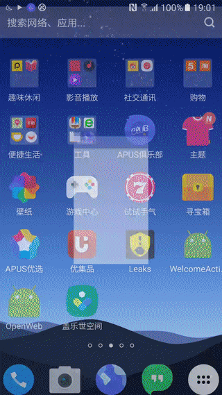

OpenWeb project
===============

Help you build a web framework quickly.
It can manages the BackForward stack automatically.



Gradle
------
```
dependencies {
    ...
    compile 'cc.solart:openweb:1.1.0'
}
```

Usage
-----
```java
public class MyOpenWebFragment extends OpenWebFragment {

    private SwipeRefreshLayout mSwipeRefreshLayout;

    /**
     * if you need pull to refresh, you can coding like this, otherwise return null.
     * Careful use of pull down refresh, it may lead to a sliding conflict with the web page.
     * You can also disable and open the drop-down refresh to circumvent this problem by JavaScript
     * @return
     */
    @Override
    protected OnRefreshStatusListener getOnRefreshStatusListener() {
        return new OnRefreshStatusListener() {

            @Override
            public boolean isRefreshing() {
                return mSwipeRefreshLayout.isRefreshing();
            }

            @Override
            public void refreshComplete() {
                mSwipeRefreshLayout.setRefreshing(false);
            }
        };
    }


    @Override
    public View onCreateView(LayoutInflater inflater, ViewGroup container, Bundle savedInstanceState) {
        View view =  super.onCreateView(inflater, container, savedInstanceState);
        mSwipeRefreshLayout = (SwipeRefreshLayout) view.findViewById(R.id.refresh_layout);
        mSwipeRefreshLayout.setOnRefreshListener(new SwipeRefreshLayout.OnRefreshListener() {
            @Override
            public void onRefresh() {
                mWebView.reload();
                mSwipeRefreshLayout.setRefreshing(false);
            }
        });
        return view;
    }

    @Override
    protected int loadLayoutRes() {
        return R.layout.openweb_fragment;
    }

    @Override
    protected int getWebViewId() {
        return R.id.webview;
    }
}
```

```xml
<?xml version="1.0" encoding="utf-8"?>
<RelativeLayout xmlns:android="http://schemas.android.com/apk/res/android"
    android:layout_width="match_parent"
    android:layout_height="match_parent"
    android:orientation="vertical">

    <android.support.v4.widget.SwipeRefreshLayout
        android:id="@+id/refresh_layout"
        android:layout_width="match_parent"
        android:layout_height="match_parent">

        <cc.solart.openweb.widget.OpenWebLayout
                    android:id="@+id/webview"
                    android:layout_width="match_parent"
                    android:layout_height="match_parent"
                    app:progressHeight="3dp"
                    app:progressDrawable="@drawable/bg_progress_horizontal"/>

    </android.support.v4.widget.SwipeRefreshLayout>

</RelativeLayout>
```

Changelog
---------
* **1.0.0**
    * Initial release
* **1.1.0**
    * Add OpenWebLayout widget, instead of WebView
    
License
-------

    Copyright 2015 - 2016 solartisan/imilk

    Licensed under the Apache License, Version 2.0 (the "License");
    you may not use this file except in compliance with the License.
    You may obtain a copy of the License at

        http://www.apache.org/licenses/LICENSE-2.0

    Unless required by applicable law or agreed to in writing, software
    distributed under the License is distributed on an "AS IS" BASIS,
    WITHOUT WARRANTIES OR CONDITIONS OF ANY KIND, either express or implied.
    See the License for the specific language governing permissions and
    limitations under the License.